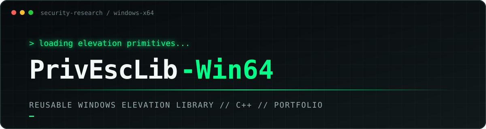
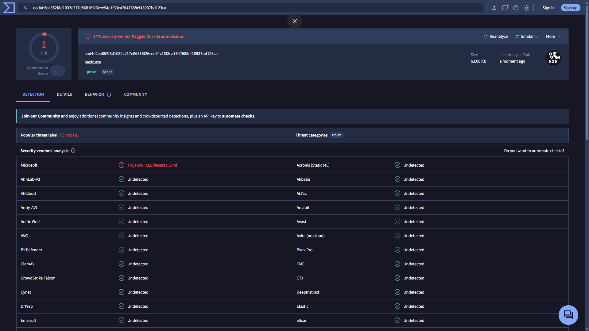

<div align="center">
  

# PrivEscLib-Win64

**Reusable Windows privilege-elevation primitives for C++ projects.**

[](#build)
[](#build)
[](#integration)
[](#responsible-use)

</div>

---

## About the project

PrivEscLib-Win64 is a low-level C++ library that packages several Windows elevation mechanisms behind a small, reusable API. Instead of rewriting the same Windows internals for every project, you can link the static library, include one header, and select the elevation method you need.

The project focuses on UAC behavior, process relaunching, COM elevation, registry-based mechanisms, and Windows security tokens. It is built as a personal security portfolio and as a practical learning resource for controlled environments.

```text
[+] Drop-in static library
[+] One public header
[+] Multiple elevation backends
[+] Native WinAPI and COM
[+] Designed for Windows x64
```

> **Author's note**
>
> This is a personal portfolio project. I studied, implemented, and tested these methods to understand how Windows elevation works under the hood. If you are reading this: yes, I wrote the code myself, method by method.

## Why a library?

Most demonstrations keep each elevation technique in a separate proof of concept. PrivEscLib-Win64 turns them into reusable building blocks that can be integrated into another authorized research project without copying an entire codebase.

- A common dispatcher for the main elevation methods
- Direct functions when lower-level control is preferred
- Minimal dependencies and a small compiled footprint
- Centralized process-path, token, registry, COM, and string helpers
- A simple example executable for validation

The library explores methods that may produce low static-detection results in a given build. It is not presented as universally "undetectable": antivirus verdicts depend on the exact binary, build configuration, behavior, and detection date. A measured result for the current sample is documented below.

---

## Implemented methods

| Method | API | Mechanism | State |
|:--|:--|:--|:--:|
| `RUNAS` | `elevate_privileges(RUNAS)` | Standard Windows `runas` relaunch | Implemented |
| `FODHELPER` | `elevate_privileges(FODHELPER)` | `ms-settings` handler and `fodhelper.exe` | Implemented |
| `CMSTPLUA` | `elevate_privileges(CMSTPLUA)` | Auto-elevated `ICMLuaUtil` COM object | Implemented |
| `COMPUTERDEFAULTS` | `elevate_privileges(COMPUTERDEFAULTS)` | `ms-settings` handler and `computerdefaults.exe` | Implemented |
| `IFILEOPERATION` | `elevate_ifileoperation()` | Acquisition and validation of the `IFileOperation` COM object | Implemented |

`IFileOperation` is exposed as a direct function rather than through the `method` enum. Its current implementation acquires the COM object, validates the result, releases it cleanly, and returns the operation status.

## Features

- Reusable static library for integration into other C++ projects
- Four elevation backends available through one dispatcher
- Direct `IFileOperation` COM helper
- Administrator detection through token membership
- Automatic discovery of the current executable path
- Registry helpers shared by registry-based methods
- XOR helpers for encoded internal strings
- Optional Authenticode signing when `signtool` is available
- Companion Windows privilege-escalation course

---

## Integration

Include the public header and link against `build/libprivesc.a`:

```cpp
#include "privesc.hpp"

int main(void)
{
    if (!is_admin() && !elevate_privileges(RUNAS))
        return (1);

    return (0);
}
```

Example link command:

```sh
g++ main.cpp -Iinclude -Lbuild -lprivesc -lole32 -o app.exe
```

Successful relaunch methods normally terminate the original process after starting the elevated copy. The new process should call `is_admin()` before performing privileged work.

## Public API

```cpp
enum method
{
    RUNAS,
    FODHELPER,
    CMSTPLUA,
    COMPUTERDEFAULTS
};

bool elevate_privileges(method meto);
bool is_admin();
char *get_myh_path(void);

bool elevate_runas();
bool elevate_fodhelper();
bool elevate_cmstplua();
bool elevate_computerdefaults();
bool elevate_ifileoperation();

std::string key_xor(const std::string &str, const std::string &key);
void print_encrypted(const std::string &str);
```

The public header also exposes the low-level registry helpers used internally by the registry-based methods.

---

## Build

### Requirements

- Windows x64
- MinGW-w64 (`g++` and `ar`)
- `mingw32-make` or compatible GNU Make
- An MSYS2/MinGW-style shell for the Makefile commands
- Windows OLE library, linked with `-lole32`
- Optional: Windows SDK `signtool` and an available signing certificate

### Compile

```sh
mingw32-make
```

### Clean rebuild

```sh
mingw32-make re
```

### Output

```text
build/
|-- libprivesc.a
|-- bin/
|   `-- basic.exe
`-- obj/
```

The default target builds the library and example, then attempts to sign generated binaries. If `signtool` is unavailable, signing is skipped without failing the build.

---

## VirusTotal result

The exact `basic.exe` sample below was flagged by **1 of 70** security vendors when the analysis was captured on **August 24, 2026**.

| Sample | Result | SHA-256 |
|:--|:--:|:--|
| `basic.exe` / PE x64 | **1 / 70** | `ead4e2ea852f8d1032c217e86816f26cee94c1f33ca7647688ef18937bd123ca` |

**[Open the full VirusTotal report](https://www.virustotal.com/gui/file/ead4e2ea852f8d1032c217e86816f26cee94c1f33ca7647688ef18937bd123ca/detection)**

<details>
<summary><strong>Show the VirusTotal screenshot</strong></summary>
<br>
<a href="https://www.virustotal.com/gui/file/ead4e2ea852f8d1032c217e86816f26cee94c1f33ca7647688ef18937bd123ca/detection">
  
</a>
</details>

> [!NOTE]
> This result applies only to the exact hash shown above. Rebuilding changes the hash, and later antivirus analyses may produce different verdicts. A low score is a measurement, not a safety guarantee.

---

## How it works

### RUNAS

- Calls `ShellExecuteA` with the `runas` verb
- Displays the standard UAC consent prompt
- Relaunches the current binary in the elevated context

### FODHELPER

- Configures the current-user `ms-settings` command handler
- Sets the command and `DelegateExecute` values
- Launches `fodhelper.exe` and relaunches the current binary

### COMPUTERDEFAULTS

- Uses the same current-user handler family
- Launches `computerdefaults.exe` as its auto-elevated entry point
- Is available through the common dispatcher

### CMSTPLUA

- Initializes COM
- Requests the elevated `ICMLuaUtil` object
- Calls its `ShellExec` method with the current executable path

### IFILEOPERATION

- Initializes COM in a single-threaded apartment
- Creates the `IFileOperation` local-server object
- Validates acquisition, releases the interface, and returns success or failure

---

## Project structure

```text
PrivEscLib-Win64/
|-- include/
|   `-- privesc.hpp
|-- src/
|   |-- core/privesc.cpp
|   |-- runas/elevate_runas.cpp
|   |-- fodhelper/
|   |   |-- fodhelper.cpp
|   |   `-- regedit.cpp
|   |-- cmstplua/cmstplua.cpp
|   |-- cddefaults/cddefaults.cpp
|   |-- ifileoperation/ifileoperation.cpp
|   |-- other/
|   |   |-- encryption.cpp
|   |   `-- isadmin.cpp
|   `-- examples/basic.cpp
|-- docs/assets/
|   |-- banner.svg
|   `-- virustotal-basic-1-of-70.png
|-- Makefile
|-- PRIVESC_COURSE.md
`-- README.md
```

## Course and portfolio

[PRIVESC_COURSE.md](PRIVESC_COURSE.md) is the learning side of the project. It covers Windows UAC, tokens, local privilege escalation concepts, defensive detection, and hardening. The course is broader than the library, so not every technique discussed there is part of the compiled API.

This repository is meant to show the complete process: researching Windows internals, turning isolated techniques into reusable C++ code, building a coherent API, and documenting the defensive context around it.

---

## Responsible use

> [!WARNING]
> This project is for education, portfolio demonstration, and authorized security research only.

The library can modify registry state, interact with Windows elevation mechanisms, and relaunch processes with elevated privileges. Use it only on systems you own or have explicit permission to test. The author and contributors are not responsible for unauthorized, harmful, or unlawful use.

---

<div align="center">

`MINIMAL.` &nbsp; `DIRECT.` &nbsp; `LOW-LEVEL.`

**No magic. No unnecessary abstraction. Understand the mechanism.**

</div>
